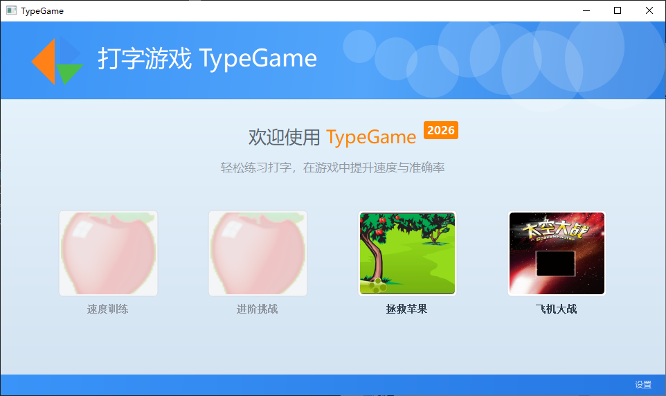
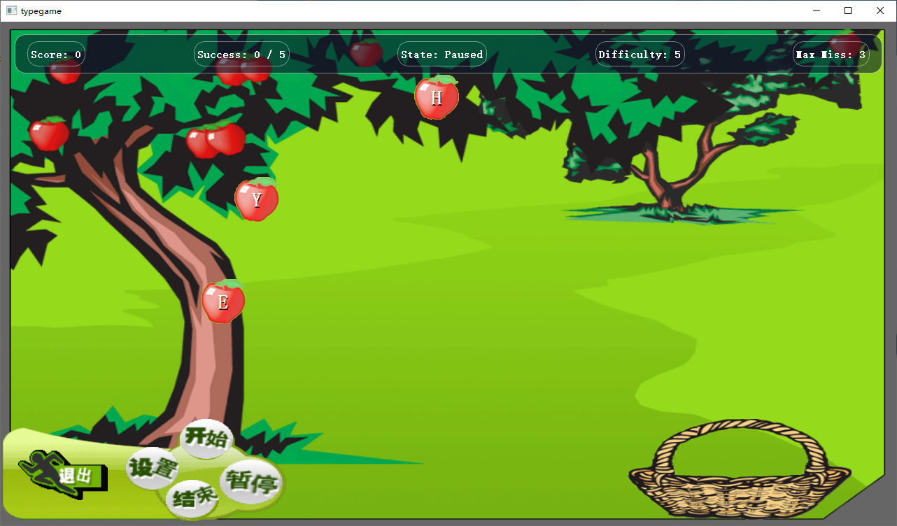
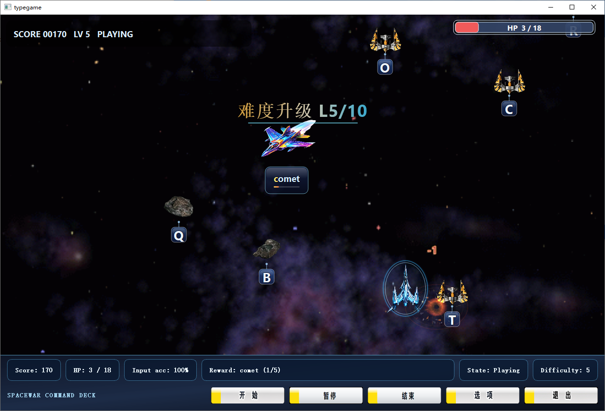
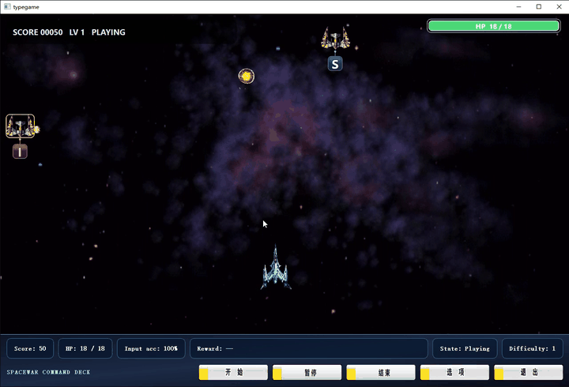
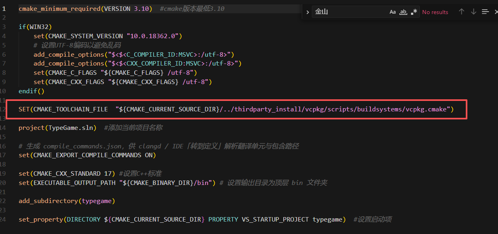
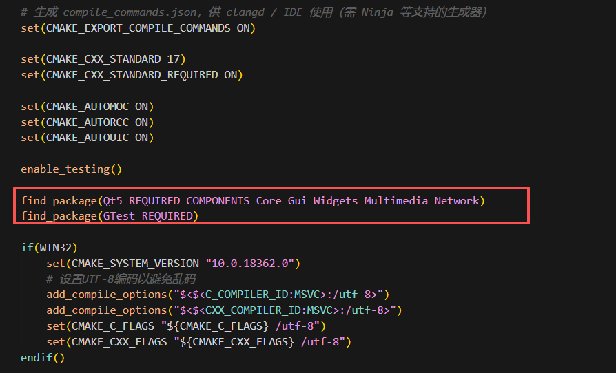
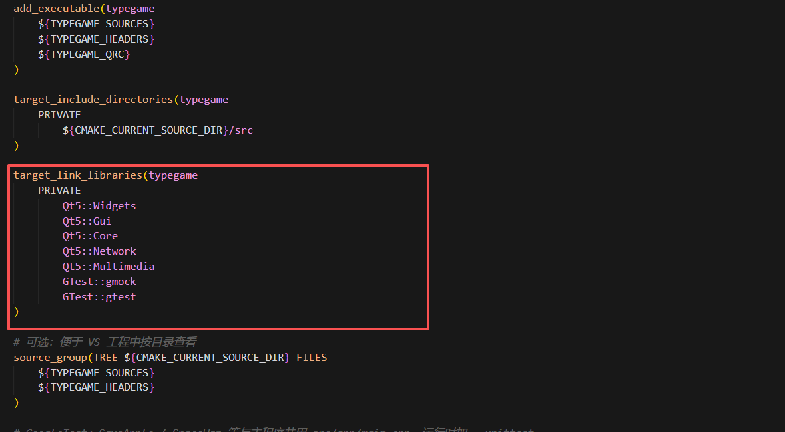
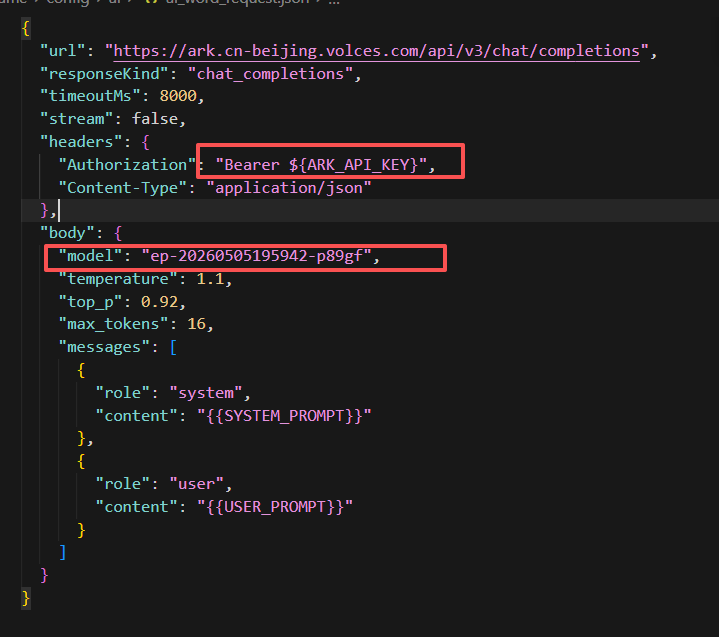

# QtTypingGamePlatform

基于 **Qt / C++** 开发的模块化打字训练游戏平台，支持“拯救苹果”和“太空大战”两种游戏模式。项目采用 MVC 分层架构，封装了通用打字游戏框架，并结合异步日志、事件观察者、对象池、AI 奖励词生成等模块，提升系统的可扩展性与工程化程度。详细架构设计见 [项目详细说明](./docs/项目整体说明.md)。

## Demo

| 首页 | 拯救苹果模式 | 太空大战模式 | 演示视频 |
|---|---|---| --- |
|  |  |  | 


## Features

- 支持双游戏模式：拯救苹果、太空大战
- 基于 MVC 架构拆分 Model / View / Controller
- 抽象通用打字游戏框架，复用输入检测、计分、状态管理等逻辑
- 使用观察者模式处理游戏事件通知
- 使用对象池管理游戏实体，减少频繁创建和销毁开销
- 支持异步日志、异步埋点、异步音频服务
- 接入 AI 单词生成服务，支持本地词库降级
- 提供命令行测试入口与 gtest 单元测试

## Tech Stack

- C++17
- Qt 5 / Qt 6
- CMake / qmake
- Google Test
- HTTP API
- MVC / Observer / Factory / Object Pool

## Project Structure

```text
.
├── app/                 # 程序入口与应用初始化
├── common/              # 通用组件与基础服务
│   ├── model/           # 基础模型
│   ├── controller/      # 基础控制器
│   ├── service/         # 日志、音频、AI 等服务
│   ├── factory/         # 工厂模块
│   └── test/            # 测试相关代码
├── saveapple/           # 拯救苹果游戏模块
├── spacewar/            # 太空大战游戏模块
├── resources/           # 图片、音效、配置等资源
└── tests/               # 单元测试与命令行测试
```

## Architecture

项目整体采用分层设计：

```text
View 层
  └── 负责界面绘制、动画展示、用户交互

Controller 层
  └── 负责输入处理、游戏流程控制、信号转发

Model 层
  └── 负责游戏状态、实体管理、计分与规则判断

Service 层
  └── 负责日志、音频、AI 单词生成、数据埋点等通用能力
```

两个游戏模式复用了通用的打字游戏抽象层，避免重复实现输入检测、状态更新、事件通知等基础逻辑。

## Core Modules

### 1. 通用游戏框架

通过 `TypingGameModelBase`、`TypingGameControllerBase` 等基类封装通用逻辑，使不同游戏模式只需要关注自身规则和表现层实现。

### 2. 太空大战模式

实现了敌机移动、子弹追踪、碰撞检测、奖励单词、生命值、难度升级等实时交互逻辑。

### 3. AI 单词生成服务

通过 `AiWordService` 接入大模型 API，根据游戏状态动态生成奖励词。当 API 请求失败或超时时，自动切换至本地词库，保证游戏流程稳定。

### 4. 异步服务

日志、音频、埋点等功能采用异步方式处理，减少对主游戏循环和 UI 响应的影响。

## Getting Started

## Recommended Environment

- OS: Windows 10/11 
- Compiler: MSVC 2022
- Qt: 5.15
- C++ Standard: C++17

### Build

```bash
git clone https://github.com/Chensir-coder/TypeGame.git
cd TypeGame
```
1. 在 [顶层CMakeLists.txt](./CMakeLists.txt) 中配置 cmake 编译所需要的第三方编译工具链(Qt、Google Test)，换为自己的地址



并在[具体编译CMakeLists.txt](./typegame/CMakeLists.txt)中相应位置修改自己的第三方工具编译工具



如需使用 ai 奖励词服务，[此处](./typegame/config/ai/ai_word_request.json) 需配置 api 内容



配置好之后， 双击 build_win.bat 编译运行。

## Highlights

- 使用 C++ / Qt 实现完整实时交互项目
- 具备清晰的模块拆分和工程化目录结构
- 通过抽象基类复用多个游戏模式的核心逻辑
- 使用对象池、工厂模式、观察者模式提升扩展性
- 引入 AI 服务，并设计失败降级机制
- 包含自动化测试与命令行测试能力

## License

MIT License
